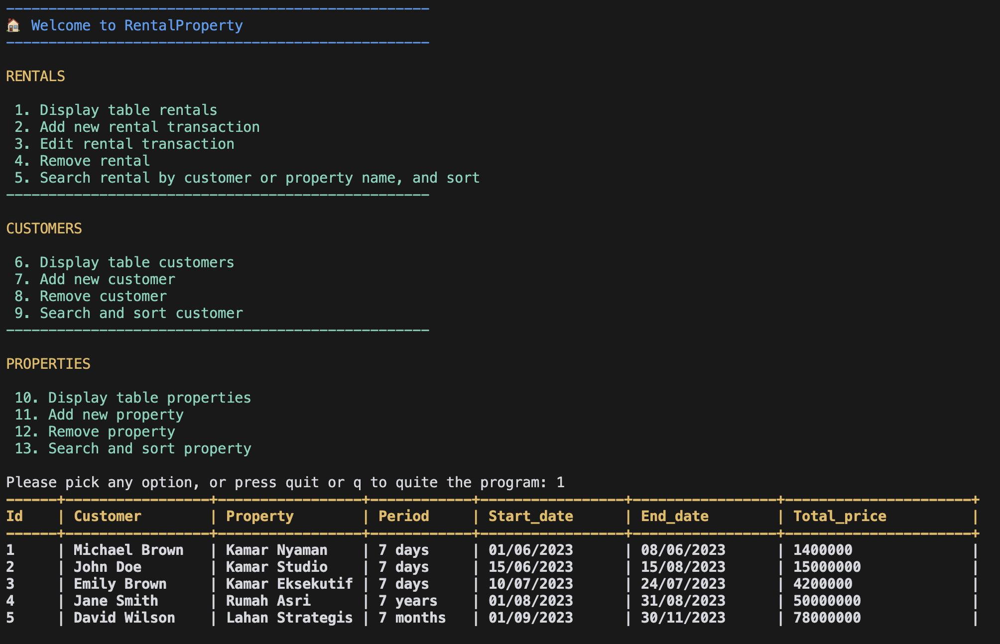

Welcome to this tutorial where we will build a simple yet effective rental property management application using Python. This application will allow users to manage rental transactions, properties, and customers through a console interface. 
<!--more-->
We will cover the key features, the tech stack, and provide a step-by-step guide to get you started.

The app will look like below:



## Table of Contents

1. [Introduction](#introduction)
2. [Features](#features)
3. [Tech Stack](#tech-stack)
4. [Setting Up the Project](#setting-up-the-project)
5. [Understanding the Code Structure](#understanding-the-code-structure)
6. [Running the Application](#running-the-application)
7. [Conclusion](#conclusion)

## Introduction

In this tutorial, we will create a console-based application that allows users to manage rental properties. The application will support CRUD (Create, Read, Update, Delete) operations for rentals, customers, and properties. We will also implement input validation and use JSON files for data persistence.

Those validations will enforce robustness of the app, and make sure that the data is consistent and reliable throughout multiple operations executed by users.

## Features

The rental property management app will include the following features:

- **CRUD Operations**: Manage rental transactions, customers, and properties.
- **Input Validation**: Ensure that user inputs are valid and handle errors gracefully.
- **Persistent Storage**: Use JSON files to store data persistently.
- **User-Friendly Console Interface**: Provide a colorful and interactive console menu.

## Tech Stack

The application is built using the following technologies:

- **Python**: The primary programming language.
- **Colorama**: A library for colorful console output.
- **JSON**: For data storage.
- **Standard Libraries**: Such as `datetime`, `os`, and `re`.

## Setting Up the Project

To get started, follow these steps:

1. **Clone the Repository**:
   ```bash
   git clone <repository-url>
   cd rental-property
   ```

2. **Create a Virtual Environment and Install Dependencies**:
   ```bash
   make venv
   ```

   The `venv` part will execute installation of the dependencies, which is defined in `requirements.txt` file. I provide flexible developer experience by using Makefile, so that both Unix-based and Windows based developers are able to easily launch the app,as shown below:

   ```Makefile
    venv:
        python -m venv venv
        @if [ -f venv/Scripts/activate ]; then \
            . venv/Scripts/activate && pip install -r requirements.txt; \
            echo '\nSuccessfully installed project dependencies!'; \
        else \
            chmod +x venv/bin/activate; \
            . venv/bin/activate && pip install -r requirements.txt; \
            echo '\nSuccessfully installed project dependencies!'; \
        fi

    run:
        python app.py

    .PHONY: venv
   ```

## Understanding the Code Structure

The project is organized into several modules:

- **app.py**: The main entry point of the application.
- **services/**: Contains business logic for rentals, customers, and properties.
- **utils/**: Utility functions for database operations and printing menus.
- **db/**: JSON files for storing data.
- **Makefile**: For easy setup and running the application in all operating systems.

## CRUD Operations

Here are some important code snippets to understand the functionality:

### Reading and printing data

**Main Application Loop (app.py)**:
```python
import os
from colorama import Fore
from utils.db import read_db
from utils.print_menu import print_menu
from services.rentals import print_rental_list, add_rental, edit_rental, remove_rental, search_sort_rental
from services.customer import print_customer_list, add_customer, remove_customer, search_and_sort as search_sort_customer
from services.property import print_property_list, add_property, remove_property, search_and_sort as search_sort_property

# Database file paths
CUSTOMERS_DB_FILE = os.path.join(os.path.dirname(__file__), 'db', 'customers.json')
PROPERTIES_DB_FILE = os.path.join(os.path.dirname(__file__), 'db', 'properties.json')
RENTALS_DB_FILE = os.path.join(os.path.dirname(__file__), 'db', 'rentals.json')

# Load data from JSON files
rentals = list(read_db(RENTALS_DB_FILE))
properties = list(read_db(PROPERTIES_DB_FILE))
customers = list(read_db(CUSTOMERS_DB_FILE))

option = ''
while option.startswith('q') == False:
    print_menu()
    option = input("Please pick any option, or press quit or q to quit the program: ").lower()

    if option == '1':
        print_rental_list(rentals, properties, customers)
    elif option == '2':
        add_rental(rentals, properties, customers)
    # Additional options...
    elif option == 'q' or option == 'quit':
        continue
    else:
        print(Fore.RED + "INVALID option! Please try again")

```

In this code, we load the 3 datasets: `rentals`, `properties`, and `customers`. All of them are stored in JSON files (due to current project's requirement). Then we do while loop to keep the application running until user decide to quit (by pressing 'q' or 'quit'). I use specific simple function calls to handle each of user options, so that `app.py` will be more clean and easy to maintain, as an entry point of the application.

The global variables will then be passed to the respective service modules, which contains the logic to perform CRUD operations.


**Printing rental table**

The JSON file structure for `rentals` is the following:

```json
[
    {
        "id": "1",
        "customer": "1",
        "property": "1",
        "start_date": "2024-01-01",
        "end_date": "2024-01-01",
        "period": "1",
        "total_price": "1200"
    },
    {
        "id": "2",
        "customer": "2",
        "property": "2",
        "start_date": "2024-01-01",
        "end_date": "2024-01-01",
        "period": "1",
        "total_price": "2000"
    }
]
```

You can see that each of them has `property` and `customer` fields, which are used as "foreign key" to identify the relationship between `rentals` and `properties` as well as `rentals` and `customers`. We use this approach to avoid duplicating customer and property data in `rentals` dataset.

```python
def populate_customer_property_info(rentals: list, customers: list, properties: list):
    result = []
    # get all customer names in a dict
    customer_dict = {}
    properties_dict = {}
    for cust in customers:
        customer_dict[cust['id']] = cust
    
    for prop in properties:
        properties_dict[prop['id']] = prop
    
    # copy each dictionary in rentals list, to avoid mutating the property and customer ID data
    for rent in rentals:
        new_rental = rent.copy()
        customer_name = ""
        property_name = ""
        try:
            customer_name = customer_dict[rent['customer']]['full_name']
        except:
            print(f"Customer ID: {rent['customer']} is no longer exist. To use empty string")

        # if property ID is not available, to use empty string as default value
        # to be shown
        try:
            current_prop = properties_dict[rent['property']]
            property_name = properties_dict[rent['property']]['name']
        except:
            print(f"Property ID: {rent['property']} is no longer exist. To use empty string")
            current_prop = { 'unit_period': ''}

        new_rental['customer'] = customer_name
        new_rental['property'] = property_name

        # populate period with unit time (days, months, or years)
        new_rental['period'] = f"{rent['period']} {current_prop['unit_period']}"

        result.append(new_rental)

    return result

```

The print table rental is not just printing headers and normal data row. I also perform exhaustive data query to get customer and property name, and populate it into the table. We first store `customers` and `properties` data into dictionaries for easier and faster access. After that, we iterate through each of rental data, and perform lookup for customer and property name.

Note also that we use `rental.copy()` to avoid mutating the original rentals data, as this data will be used by other functions, and they expect the original `ID` only in `customer` and `property` fields.


### Adding/Creating a Rental

```python
def add_rental(rentals: list, properties: list, customers: list):
    print_property_list(properties)
    property_id = input("\nPlease the property ID for rent: ")
    if not property_id.isdigit():
        print("\nError: Property ID must be a number!")
        return
    
    property_id = int(property_id)
    is_valid, selected_property = validate_and_get_property(property_id, properties, rentals)

    if not is_valid:
        return

    print_customer_list(customers)
    customer_id = input("\nPlease the customer ID for rent: ")
    if not customer_id.isdigit():
        print("\nError: Customer ID must be a number!")
        return
    
    customer_id = int(customer_id)
    is_valid = is_valid_customer(customer_id, customers)

    if not is_valid:
        return

    start_str = input("Please input start date of the rent - format DD/MM/YYYY: ")
    is_valid = is_date_format(start_str)
    if not is_valid:
        print(f"\nDate {start_str} is not in format DD/MM/YYYY")
        return
    
    end_str = input("Please input end date of the rent - format DD/MM/YYYY: ")    
    is_valid = is_date_format(end_str)
    if not is_valid:
        print(f"\nDate {end_str} is not in format DD/MM/YYYY")
        return


    new_id = get_next_id(rentals)

    # use default 1 id in case new list
    if new_id == -1:
        new_id = 1
    
    # get period
    start_date, is_valid = validate_and_generate_date(start_str)
    if not is_valid:
        return

    end_date, is_valid = validate_and_generate_date(end_str)
    if not is_valid:
        return
    
    period = get_period(start_date, end_date, selected_property['unit_period'])
    period = round(period)
    total_price = calculate_total_price(unit_price=selected_property['unit_price'], period=period)
    
    new_rental = {
        "id": new_id,
        "customer": customer_id,
        "property": property_id,
        "start_date": start_date.strftime("%d/%m/%Y"),
        "end_date": end_date.strftime("%d/%m/%Y"),
        "period": period,
        "total_price": round(total_price)
    }

    rentals.append(new_rental)
    print("New rental has been created successfully!\nPlease select print rental option in main menu")

```

The adding rental process is very complex, mainly due to several validations and specific logic:

1. We first validate the property and customer ID, to ensure that they are valid and exist in the respective datasets.
2. We then validate the date format, to ensure that the date is in the correct format.
3. We then calculate the period and total price of the rental.
4. We then create a new rental object, and append it to the rentals list.
5. Print a success message, and prompt the user to print the rental list to see the newly added rental.

In point 2 and 3, we use `datetime` module to handle date and time, as well as calculate the period of the rental.

Notice in point 4, we use `get_next_id(rentals)` to get the next available ID for the new rental. This is to ensure that the new rental ID is unique, similar to primery key in database.

### Updating a Rental
```python
def edit_rental(rentals: list, properties: list, customers: list):
    rental_id = input("Please select rental ID to edit: ")
    if not rental_id.isdigit():
        print("\nError: Rental ID must be a number!")
        return

    rental_id = int(rental_id)
    is_valid_rental, selected_rental = is_validate_rental(rental_id, rentals)
    
    if not is_valid_rental:
        return

    field = input("Please enter the field to edit ('customer', 'property', 'start_date', 'end_date'): ")
    field = field.lower()

    if is_valid_field(field) is False:
        print("\nError: Invalid field to edit!")
        return
    
    new_value = ""
    if field == 'customer' or field == 'property':
        new_value = input(f"Please enter new data for '{field}' : ")
        if not new_value.isdigit():
            print(f"Error: {field} must be a number!")
            return

        new_value = int(new_value)

        if field == 'property':
            is_valid = validate_and_get_property(new_value, properties, rentals)
            if not is_valid:
                return
        elif field == 'customer':
            if not is_valid_customer(new_value, customers):
                return

        new_entry = {
            field: int(new_value),
        }
        selected_rental.update(new_entry)
    else:
        if field == 'start_date' or field == 'end_date':
            new_value = input(f"Please enter new date for '{field}' (format DD/MM/YYYY): ")
            if not is_date_format(new_value):
                print("\nError: Please use DD/MM/YYYY format!")
                return
        
        new_entry = {
            field: new_value
        }
        selected_rental.update(new_entry)

    print("Successfully updated!")

```

Similar to adding a rental, we perform multiple validations to make the app robust. We first validate the rental ID, to ensure that the rental is valid and exist in the rentals list. Then we ask the fields to be edited, and the respective values that are going to be updated.

Our code also enforce `DRY` principle by using helper functions, such as `is_valid_field(field)` to check if the field is valid, and `is_valid_customer(customer_id, customers)` to check if the customer ID is valid. Morever, `validate_and_get_property` function is also used to validate the property ID. Thus, consistent logic and behavior is guaranteed throughout the application, making it easier for developers to maintain and extend the code in the future.

After all validations are passed, we then update the rental data, and print a success message.

### Deleting a Rental
```python
def remove_rental(rentals: list):
    rental_id = input("Please select rental ID to remove: ")
    if not rental_id.isdigit():
        print("\nError: Rental ID must be a number!")
        return

    rental_id = int(rental_id)
    is_valid_rental, _ = is_validate_rental(rental_id, rentals)
    
    if not is_valid_rental:
        return
    
    # the remove is updated on the original list
    rentals[:] = list(filter(lambda item: item['id'] != rental_id, rentals))
    print(f"Rental ID {rental_id} is successfully removed!")
```

The delete operation is much more straightforward, because we only need to validate the rental ID type and rental is exist, and then remove the rental from the rentals list.

## Running the Application

To run the application, simply execute the following command in your terminal:
```bash
make run
```
You will be greeted with a colorful console menu where you can choose various options to manage rentals, customers, and properties.

## Conclusion

In this tutorial, we have built a rental property management application using Python. We covered the features, tech stack, and also detailed explanations to make sure our app is robust and ready for real business cases. 

Even though we don't offer multiple features to the users, this project can serve as a great starting point for anyone looking to learn about building console applications in Python, with a little bit complexity in manual querying setup between Python standard collections (dict, list, etc)

Feel free to explore the code, add new features, or modify existing ones to suit your needs. Happy coding!

[Take a look on my project and please submit any comment or issues!](https://github.com/andresuchdata/python-crud-json)


